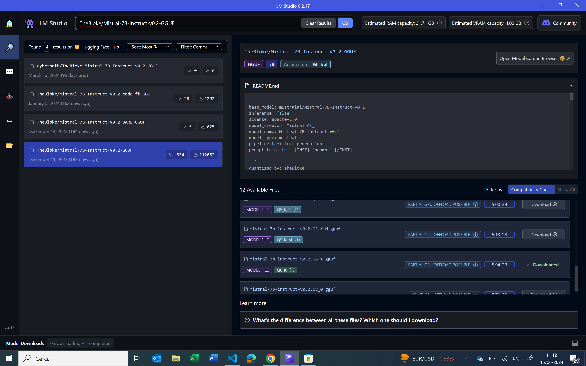
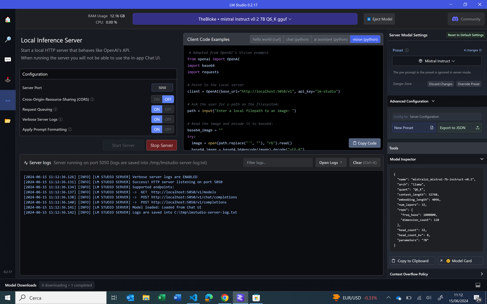

# CHAT OFFLINE WITH YOUR PDF USING MISTRAL 7B #

In this project you will learn to use Artificial Intelligence to ask question at your pdf and to obtain response, totally in local. I used model Mistral 7B. 

## START SERVER ##

To start server to load model Mistral 7B, you must download [LM Studio](https://lmstudio.ai/). In the LM Studio, you search for "TheBloke/Mistral-7B-Instruct-v0.2-GGUF" and download it. Now start server. 




## START CLIENT ##

Installing dependencies:

```
pip install -U sentence-transformers
pip install -qU pypdf langchain_community
pip install -qU langchain-mistralai
pip install -U langchain-core langchain-mistralai
```

Client: 

```
from langchain_mistralai import ChatMistralAI
from langchain_community.document_loaders import PyPDFLoader
from langchain_text_splitters import RecursiveCharacterTextSplitter
from langchain_community.vectorstores import Chroma
from langchain_community.embeddings.sentence_transformer import (
    SentenceTransformerEmbeddings,
)
from langchain.chains import create_retrieval_chain
from langchain.chains.combine_documents import create_stuff_documents_chain
from langchain_core.prompts import ChatPromptTemplate


model = ChatMistralAI(endpoint="http://localhost:5050/v1/", api_key="not-needed")

#Load file pdf
file_path = "prova.pdf"
loader = PyPDFLoader(file_path)

docs = loader.load()

print(len(docs))

#split document in small parts and load them in vectore store
text_splitter = RecursiveCharacterTextSplitter(chunk_size=1000, chunk_overlap=200)
splits = text_splitter.split_documents(docs)
embedding_function = SentenceTransformerEmbeddings(model_name="all-MiniLM-L6-v2")
vectorstore = Chroma.from_documents(splits, embedding_function)

docs = vectorstore.as_retriever(search_type="mmr")


system_prompt = (
    "You are an assistant for question-answering tasks. "
    "Use the following pieces of retrieved context to answer "
    "the question. If you don't know the answer, say that you "
    "don't know. Use three sentences maximum and keep the "
    "answer concise."
    "\n\n"
    "{context}"
)

prompt = ChatPromptTemplate.from_messages(
    [
        ("system", system_prompt),
        ("human", "input({input})"),
    ]
)


question_answer_chain = create_stuff_documents_chain(model, prompt)
rag_chain = create_retrieval_chain(docs, question_answer_chain)

results = rag_chain.invoke({"input": input("insert your request")})

results

```


